# Trabalho 1 - Análise Léxica

**Disciplina:** MATA61 - Compiladores 
**Professor:** Adriano Maia  
**Aluno(s):** Fabio Miguel, Guilherme Caria e Heverton Reis  
**Data de Entrega:** 20/10/2025

---

## Documentação da Linguagem

A linguagem Sloth tem como objetivo atender aos “preguiçosos” do mundo da programação, proporcionando uma experiência de programar numa linguagem com estrutura similar ao Python mas que traz uma grande economia de caracteres.

Abaixo, tem-se um exemplo de um código simples em Python convertido para Sloth. Este código recebe dois números inteiros, realiza uma soma e verifica a paridade:

```python
#Código Python

numeroBase = 13

listaNumeros = [2, 7, 10, 5, 8]

def somarVerificarParidade(numeroLista, numeroBase):
    soma = numeroLista + numeroBase
    
    if soma_v % 2 == 0:
        return True
    else:
        return False

print("Número base fixo: {numeroBase}\n")

for index in listaNumeros:
    soma = index + numeroBase
    
    if somarVerificarParidade(index, numeroBase):
        print("Soma {index} + {numeroBase} = {soma} (Resultado PAR)")
    else:
        print("Soma {index} + {numeroBase} = {soma} (Resultado ÍMPAR)")
```

Em seguida, o mesmo código escrito em Sloth:

```python
# Código Sloth (corrigido)

I numeroBase = 13

I listaNumeros = [2, 7, 10, 5, 8]

FN somarVerificarParidade(I numeroLista, I numeroBase)
	I soma = numeroLista + numeroBase
	
	IF soma % 2 == 0
		R T
	EL
		R F
		
PT 'Número base fixo: $numerobase\n'

FR index IN listaNumeros
	I soma = index + numeroBase
	
	IF somarVerificarParidade(index, numeroBase)
		PT 'Soma $index + $numeroBase = $soma (Resultado PAR)'
	EL
		PT 'Soma $index + $numeroBase = $soma (Resultado ÍMPAR)'

```

### 1. Análise Léxica e Estrutura

#### 1.1 Indentações

Um código em Sloth é estruturado utilizando espaços em branco e newlines, de modo a eliminar qualquer tipo de identificador para definir uma estrutura “pai e filho” para códigos pertencentes a uma função ou similares.

O analisador Léxico gera tokens do tipo <indent> ou <dedent> somente ao detectar *whitespace* antes do início de uma linha de código (antes do primeiro caractere que não é um *whitespace*) e faz isso utilizando uma pilha de indentação e comparando o seu nível de indentação ao topo da pilha.

Caso uma nova coluna possua uma indentação maior que o topo da pilha, apenas um indent é gerado e a nova coluna é colocada na pilha. Caso a indentação seja a mesma, nada é feito. No caso da indentação da nova coluna ser menor do que o que consta na pilha, emite o número de dedents necesários e remove da pilha até a equalização.

O nível de indentação de uma linha pode ser comparado ao da linha anterior e caso seja maior, por qualquer número que seja, gera um token <indent> e incrementa o nível de indentação guardado, caso seja menor, produz tokens <dedent> representativos do quanto o código foi recuado. 

Exemplo:

```python
FN bigNumber number
	IF number > 0 & number < 1000 #Gera um <indent>
										PT 'Thats not very big now is it?' #Também gera apenas um <indent>
		PT "I'm sure you can do better" #Não gera nenhum token relacionado a indentação
										
	EF number >= 10000 & number < 1000000 #Gera um <dedent>
		PT 'Hey thats pretty big'#Gera um <indent>
EF number > 1000000 #Gera dois <dedent> (Ofereceria um erro apenas na fase sintática)
	PT 'Now thats a BIIIIIG number' #Gera um <indent>
```

Tokens de <indent> e <dedent> também não são gerados dentro de parêntesis, no caso de uma utilização de função multi-linha (ver exemplo na seção 1.3 Newlines).

Logo abaixo, temos o Diagrama Mermaid para a emissão de Tokens <indent> e <dedent> da lógica de Indentação/Desindentação da linguagem Sloth. Este é um dos diagramas mais importantes do Analisador Léxico, devido ao fato de que a indentação é baseada em espaços em branco no início da linha de código.

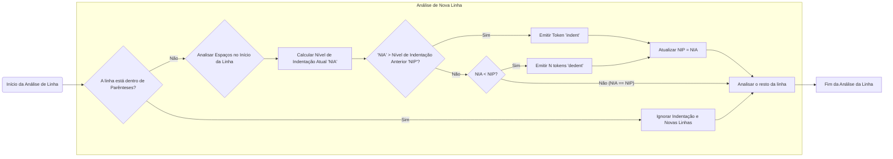


#### 1.2 Whitespaces entre tokens

Em Sloth, os whitespaces são ignorados apenas quando não estão no início de  uma linha, e podem ser usados entre caracteres como no exemplo:

```python
FL a   = 19.01
FL b=2.4
FL c=  a  +b
```

Por exemplo, *ab, a      b, produzem o mesmo token <id, ab>, mas +a, +    a sempre produzem tokens separados <+> e <id, a> pois  “+a” não é um token válido.*

#### 1.3 Newlines

As quebras de linha em Sloth são importantes e podem ser categorizadas em duas formas, quebras de linha lógicas e quebras de linha físicas.

- Quebras de linha lógicas:
    
    Estas ocorrem quando uma linha de código é finalizada, tudo após esta quebra de linha representa um novo comando, por exemplo:
    
    ```python
    I number= 0 #Token NEWLINE gerado aqui
    PT number + 10
    ```
    
- Quebras de linha físicas:
    
    São as quebras de linha que não configuram uma nova linha de código são ignoradas, a exemplo de quebras de linha sucessivas ou quebras de linha dentro de parênteses:
    
    ```python
    F newHP= damageCalculation(
    	playerHP,
    	
    	
    	baseDamage,
    	
    	attackElement,
    	playerDefense,
    	armorElementalEnchantment
    )#Token NEWLINE gerado aqui, nenhum <indent> ou <dedent> gerado dentro dos parênteses
    PT newHP
    ```
    

Em Mermaid, teremos formado o seguinte diagrama de identificação de quebras de linha.

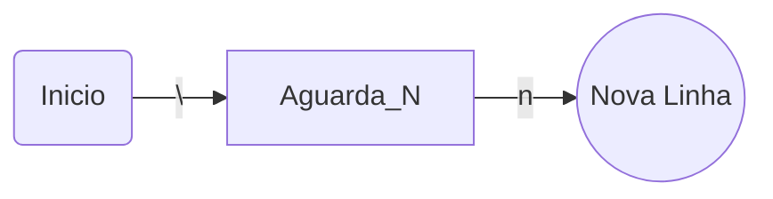
#### 1.4 Keywords

As keywords reservadas para a linguagem e não podem ser usadas como identificadores e devem ser escritas exatamente como estão aqui:

|  |  |  |  |  |
| --- | --- | --- | --- | --- |
| FN (declaração de função) | S (variável string) | R (return) | IN (in) | AW (await) |
| I (variável inteiro) | T (true) | IF (if) | FR (for) | TY (try) |
| FL (variável float) | F (false) | EL (else) | WL (while) | EX (except) |
| C (continue) | B (break) | EF (else if) | FM (from) | AS (async) |

#### 1.5 Identificadores

Os identificadores podem conter letras (a-z e A-Z), podem conter underline “_” e exceto pelo primeiro caractere, dígitos 0-9.

Não é possível usar caracteres fora do range ASCII.

Exemplo:

```python
#Declaração correta
I nomeDaVariavel
FL _nomeDAVARIAVEL
I variavelUm1

#Declaração incorreta
I 1variavelUm
FL 🤠variavel🤠 #emojis são UTF-8
```

O diagrama Mermaid em sequência é importante para mostrar como o Analisador reconhece um identificador válido e, em seguida, decide se ele é uma palavra-chave reservada ou um nome de variável/função.

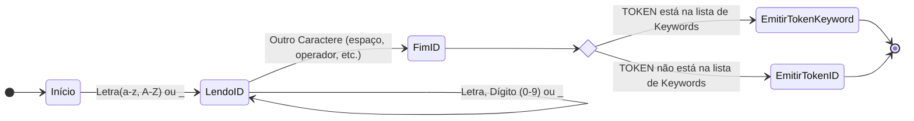

O Diagrama de Estados abaixo ilustra o processo que o Analisador Léxico segue para identificar se uma sequência de caracteres é um número inteiro ou um número de ponto flutuante.

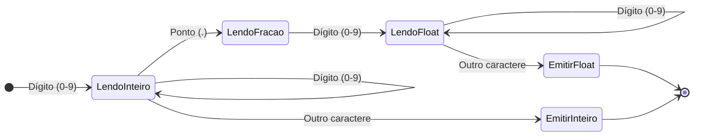

#### 1.5.1 String Literals

Strings podem ser escritas tanto com single quotes ‘ ‘ ou double quotes “ ”.

```python
'text'
"text"

#Necessário quando ' é usado dentro de uma sentença pois a primeira ocorrência
#de single quotes finaliza a string.
'Don't eat my pickles'
"Don't eat my pickles"
```

Definimos como o Analisador processa as Strings, lidando com os dois tipos de aspas e garantindo que ele consuma todo o conteúdo até encontrar a aspas correspondente.

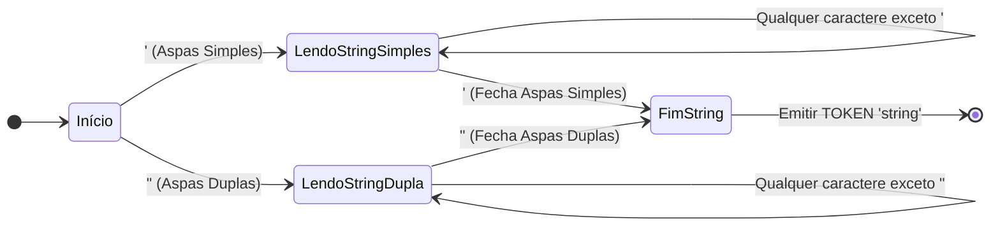

#### 1.5.2 Operadores e símbolos

Os operadores em Sloth são similares aos encontrados em outras linguagens de programação com exceção dos operadores “and” e “or”, que são substituídos por “&” e  “|” respectivamente.

| Operador | Significado |
| --- | --- |
| & | Logic And |
|  barra vertical | Logic Or |
| == | Equal |
| ! = | Not Equal |
| > = | Greater or Equal |
| < = | Lesser or Equal |
| > | Greater |
| < | Lesser |
| = | Assign |
| + | Plus |
| - | Minus |
| / | Division |
| * | Multiplication |
| % | Modulus |

Este diagrama de autômatos finitos descreve como o analisador léxico da linguagem reconhece diferentes operadores, símbolos e separadores.

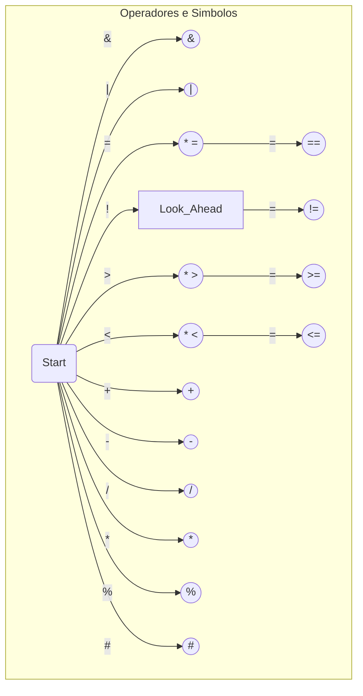


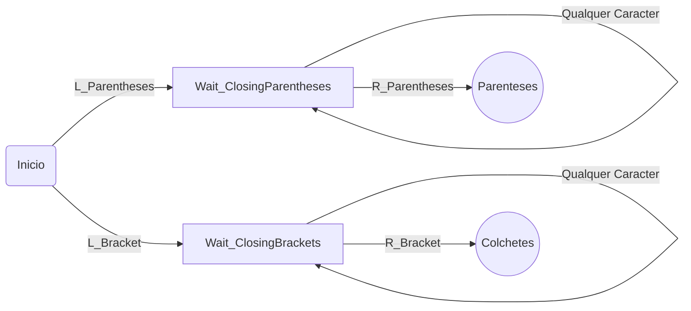

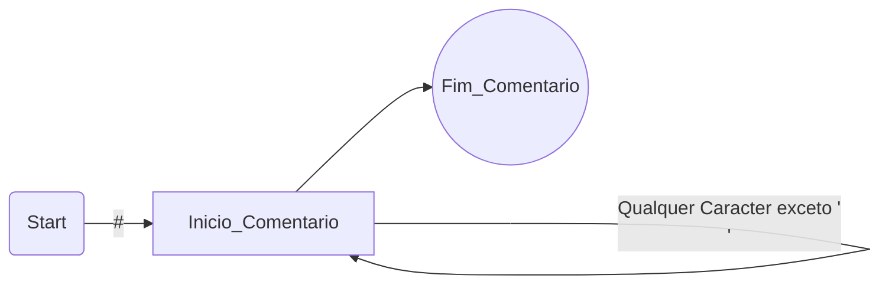

Importante ressaltar a existência do Operador para Comentários de Linha, presente na linguagem Sloth.

### 2. Exemplo de sequência de tokens

Abaixo temos um código simples de exemplo Sloth e a sua sequência de tokens gerada:

```python
FN comparador(FL a, FL b)
	IF a >= b
		R 'a é maior ou igual a b'
	EL
		R 'b é maior que a'
```

A sequência de tokens gerada seria:

```python
<FN><id,1><(><FL><id,2><FL><id,3><)><NEWLINE>
<indent><IF><id,2><>><=><id,3><NEWLINE>
<indent><R><string,'a é maior ou igual a b'><NEWLINE>
<dedent><EL><R><string,'b é maior que a'>
```

Com a tabela de tokens:

| Token ID | Token Value |
| --- | --- |
| 1 | comparador |
| 2 | a |
| 3 | b |

Por fim, mas não menos importante, este fluxograma de alto nível mostra como todos os componentes se encaixam. Ele descreve o processo contínuo de consumir o código-fonte e gerar a sequência de tokens.

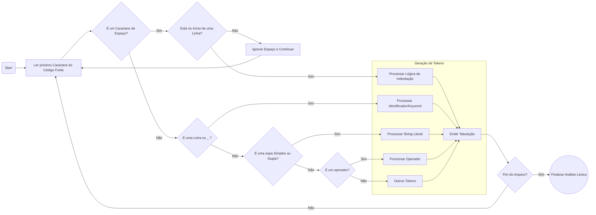

### 3. Execução do Analisador Léxico

Todas as regras discutidas ao longo deste documento foram reunidas e escritas em um analisador léxico na linguagem Flex sob o nome de `sloth.l` .

Para submeter um código escrito em Sloth ao crivo do analisador léxico, é preciso primeiro compilá-lo seguindo os passos:

```bash
flex sloth.l
gcc lex.yy.c -lfl -o sloth_scan 
```

Depois é só chamar o `sloth_scan` apontando para o arquivo `.lang` que se deseja analisar. Foram preparados alguns arquivos de teste para a linguagem, que envolvem desde: atribuição de variáveis, loops, condicionais e o exemplo do início, da soma e paridade. Outros exemplos podem ser criados para teste. Ex:

```bash
./sloth_scan soma_paridade.lang
```